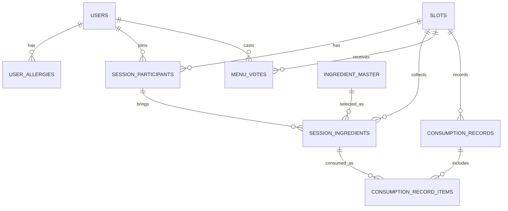

# 냉장고 반상회 MVP ERD

작성일: 2026-06-26

## 1. ERD 설계 기준

이 ERD는 해커톤 MVP 구현에 필요한 테이블만 남긴 최소 데이터 모델이다.

설계 기준:

- 주 데이터베이스는 RDS다.
- 운영자/관리자 콘솔용 테이블은 만들지 않는다.
- 학교·지자체용 정교한 계정/권한 테이블은 MVP에서 만들지 않는다.
- 공용 키트는 DB 테이블이 아니라 백엔드 상수로 관리한다.
- 사용자 리포트는 RDS 원자료를 계산해 만들고, 완료 세션의 스마트캠퍼스 성과 로그는 DynamoDB `campus_sustainability_reports`에 저장한다.
- Bedrock 내부 후보 6개 전체는 DB에 저장하지 않는다.
- 프론트엔드에 표시할 최종 후보 4개만 `slots.candidates_json`에 저장한다.
- 탄소계수 출처와 문헌 근거는 DB가 아니라 [21_냉장고반상회_탄소계수_출처_매핑.md](/Users/chataehun/Documents/아이디어/21_냉장고반상회_탄소계수_출처_매핑.md)에 문서로 남긴다.

## 2. 개념 ERD

## 3. 테이블 정의

### 3.1 users

| 컬럼 | 타입 예시 | 설명 |
|---|---|---|
| id | bigint PK | 사용자 ID |
| email | varchar unique | 학교 이메일 |
| password_hash | varchar | 비밀번호 해시 |
| nickname | varchar | 앱 표시 닉네임 |
| cooking_skill | enum | `HIGH`, `MEDIUM`, `LOW` |
| created_at | datetime | 생성 시각 |
| updated_at | datetime | 수정 시각 |

### 3.2 user_allergies

| 컬럼 | 타입 예시 | 설명 |
|---|---|---|
| id | bigint PK | 알레르기 ID |
| user_id | bigint FK | 사용자 ID |
| allergen_tag | varchar 또는 enum | 예: `crustacean_shellfish`, `egg`, `milk` |

화면 표시명은 DB에 저장하지 않고 클라이언트의 태그 라벨 매핑으로 처리한다.

### 3.3 slots

장소/시간/스테이션 단위의 조리 슬롯이다.

| 컬럼 | 타입 예시 | 설명 |
|---|---|---|
| id | bigint PK | 슬롯 ID |
| date | date | 조리 날짜 |
| start_time | time | 시작 시간 |
| end_time | time | 종료 시간 |
| place_name | varchar | 장소명 |
| station_code | varchar | `A`~`F` |
| capacity | int | 기본 4 |
| status | enum | `OPEN`, `MENU_PROPOSED`, `COMPLETED` |
| candidates_json | json nullable | 내부 후보 6개 중 백엔드가 선정한 최종 A/B/C/D 후보 JSON |
| selected_menu_json | json nullable | 투표로 확정된 메뉴 후보 JSON |
| cooking_plan_json | json nullable | 확정 메뉴 기준 단계별 협업 조리 플랜 JSON |
| recommendation_count | int | 추천 생성 횟수. 기본 0 |
| created_at | datetime | 생성 시각 |
| updated_at | datetime | 수정 시각 |

### 3.4 session_participants

| 컬럼 | 타입 예시 | 설명 |
|---|---|---|
| id | bigint PK | 참여 ID |
| slot_id | bigint FK | 슬롯 ID |
| user_id | bigint FK | 사용자 ID |
| can_purchase | boolean | 추가구매 가능 여부 |
| joined_at | datetime | 참여 시각 |

제약:

- `(slot_id, user_id)` unique
- `slot_id`당 참여자 최대 4명

참여 취소는 MVP에서 row 삭제 또는 슬롯 상태 기준 제한으로 처리한다.

### 3.5 ingredient_master

사용자가 검색/선택할 수 있는 식재료 마스터다. 원본은 [001_ingredient_master_seed.sql](/Users/chataehun/Documents/아이디어/kiro_backend/src/main/resources/db/seed/001_ingredient_master_seed.sql)이다.

| 컬럼 | 타입 예시 | 설명 |
|---|---|---|
| id | bigint PK | 식재료 ID |
| name_ko | varchar unique | 한국어명 |
| grams_per_count | decimal | 1개당 추정 g |
| allergen_tags_json | json | 알레르기 태그 목록 |
| carbon_factor_kgco2e_per_kg | decimal | kg당 추정 내재 탄소 가치 |

`category`를 두지 않는 이유:

- 알레르기는 `allergen_tags_json`으로 처리한다.
- 사용자 검색 필터는 이름 검색만으로 충분하다.
- 저탄소 후보 검증은 사용자 식재료가 아니라 Bedrock `purchaseItems.category`에서 처리한다.

### 3.6 session_ingredients

참여자가 특정 슬롯에 가져올 재료다.

| 컬럼 | 타입 예시 | 설명 |
|---|---|---|
| id | bigint PK | 세션 재료 ID |
| slot_id | bigint FK | 슬롯 ID |
| participant_id | bigint FK | 참여 ID |
| ingredient_id | bigint FK | 식재료 ID |
| count | decimal | 개수 입력값 |
| known_grams | decimal nullable | 사용자가 알고 있는 실제 g |
| estimated_grams | decimal | 추정 중량 |
| created_at | datetime | 입력 시각 |

실제 g 입력은 모든 재료에서 선택 입력으로 허용한다. 별도 허용 여부 컬럼은 두지 않는다.

### 3.7 menu_votes

| 컬럼 | 타입 예시 | 설명 |
|---|---|---|
| id | bigint PK | 투표 ID |
| slot_id | bigint FK | 슬롯 ID |
| voter_id | bigint FK | 사용자 ID |
| candidate_label | varchar nullable | A/B/C/D 선택 시 후보 라벨 |
| vote_type | enum | `A`, `B`, `C`, `D`, `E` |
| reason_text | text nullable | E 선택 이유 |
| recommendation_count | int | 투표 대상 추천 차수 |
| created_at | datetime | 투표 시각 |

제약:

- `(slot_id, voter_id, recommendation_count)` unique

### 3.8 consumption_records

방 단위 결과 제출 헤더다. 사진 URL도 이 테이블에 함께 저장한다.

| 컬럼 | 타입 예시 | 설명 |
|---|---|---|
| id | bigint PK | 결과 기록 ID |
| slot_id | bigint FK unique | 슬롯 ID |
| submitted_by_user_id | bigint FK | 제출자 |
| finished_food_rate | int | 완성 음식 소비율 |
| cooked_photo_url | varchar | 완성 음식 사진 URL |
| after_photo_url | varchar | 식후 사진 URL |
| total_leftover_input_grams | decimal | 등록된 남은 재료 총량 snapshot |
| total_leftover_used_grams | decimal | 실제 소진된 남은 재료 총량 snapshot |
| avg_ingredient_use_rate | int | 재료별 평균 소진율 snapshot |
| estimated_food_waste_reduced_grams | decimal | 예상 음식물쓰레기 감소량 snapshot |
| estimated_carbon_saved_kgco2e | decimal | 버려질 뻔한 식재료의 추정 내재 탄소 가치 snapshot |
| refund_score | int | 환급 점수 |
| base_fee_credits | int | 기준 공용비. MVP 기본 2000 |
| refund_amount_per_user | int | 1인당 환급액 |
| total_refund_amount | int | 세션 전체 환급액 |
| submitted_at | datetime | 제출 시각 |

확정 메뉴 정보는 `slots.selected_menu_json`에서 읽는다.

### 3.9 consumption_record_items

재료별 소진율이다.

| 컬럼 | 타입 예시 | 설명 |
|---|---|---|
| id | bigint PK | ID |
| record_id | bigint FK | 결과 기록 ID |
| session_ingredient_id | bigint FK | 세션 재료 ID |
| use_rate | int | `0`, `25`, `50`, `75`, `100` |
| estimated_used_grams | decimal | 추정 사용 g |

## 4. DynamoDB 성과 로그

### 4.1 campus_sustainability_reports

`campus_sustainability_reports`는 RDS 테이블이 아니라 DynamoDB 테이블이다. 세션 완료 시 EC2 백엔드가 RDS 원자료를 계산한 뒤, 학교·지자체·스마트캠퍼스 성과 대시보드가 바로 읽을 수 있는 완료 세션 단위 로그를 남긴다.

권장 key:

| 항목 | 예시 | 설명 |
|---|---|---|
| pk | `CAMPUS#INHA` | 캠퍼스/기관 단위 파티션 |
| sk | `COMPLETED#2026-06-29T20:00:00#SLOT#10` | 완료 시간과 슬롯 기준 정렬 키 |

주요 attributes:

| 항목 | 설명 |
|---|---|
| slotId | RDS 슬롯 ID |
| date | 조리 날짜 |
| placeName | 장소명 |
| stationCode | 스테이션 |
| participantCount | 참여자 수 |
| menuName | 확정 메뉴명 |
| menuType | `GENERAL` 또는 `LOW_CARBON` |
| totalLeftoverInputGrams | 등록된 남은 재료 총량 |
| totalLeftoverUsedGrams | 실제 소진된 남은 재료 총량 |
| avgIngredientUseRate | 재료별 평균 소진율 |
| finishedFoodRate | 완성 음식 소비율 |
| estimatedFoodWasteReducedGrams | 예상 음식물쓰레기 감소량 |
| estimatedCarbonSavedKgco2e | 버려질 뻔한 식재료의 추정 내재 탄소 가치 |
| refundScore | 환급 점수 |
| refundAmountPerUser | 1인당 환급액 |
| totalRefundAmount | 세션 전체 환급액 |
| cookedPhotoUrl | 완성 음식 사진 URL |
| afterPhotoUrl | 식후 사진 URL |
| createdAt | 로그 생성 시각 |

사용자 리포트는 RDS 원자료를 계산하거나, 같은 세션의 DynamoDB 로그가 있으면 그 값을 조회해 표시할 수 있다. 학교·지자체·스마트캠퍼스 성과 대시보드는 DynamoDB 로그를 기준으로 누적 소진량, 저탄소 선택률, 환급 성과, 사진 증빙을 보여준다.

## 5. MVP에서 별도 테이블로 만들지 않는 것

- 공용 키트는 백엔드 상수로 관리하고 Bedrock 프롬프트에만 넣는다.
- 메뉴 후보, 추가구매 품목, 조리 플랜은 정규화하지 않고 슬롯의 JSON 컬럼에 저장한다.
- 사진 메타데이터 테이블은 만들지 않고 결과 기록에 S3 URL만 저장한다.
- RDS에는 별도 결과 요약 테이블과 크레딧 거래 원장을 만들지 않는다. 결과 요약 원자료와 snapshot은 `consumption_records`, `consumption_record_items`, `slots.selected_menu_json`에 남기고, 기관용 성과 로그는 DynamoDB에 저장한다.

## 6. 상태 전이와 주요 저장 타이밍

| 상태 | 저장/변경되는 주요 테이블/컬럼 |
|---|---|
| 회원가입 | users, user_allergies |
| 슬롯 참여 | session_participants, session_ingredients |
| 추천 생성 | slots.candidates_json, slots.recommendation_count |
| 투표 | menu_votes |
| 메뉴 확정 | slots.selected_menu_json, slots.cooking_plan_json |
| 결과 제출 | consumption_records, consumption_record_items, DynamoDB campus_sustainability_reports |

## 7. DB 설계 시 주의점

1. `slots.candidates_json`, `slots.selected_menu_json`, `slots.cooking_plan_json`은 MVP 구현을 쉽게 하기 위한 JSON 저장이다.
2. Bedrock 응답은 JSON 스키마, 내부 후보 key, 알레르기, 추가구매 가능자 여부, 저탄소 후보의 고기/해산물 포함 여부만 런타임으로 최소 검증한다.
3. 추가구매 품목은 식재료 마스터와 대조하지 않는다.
4. 공용 키트는 DB가 아니라 백엔드 상수로 관리한다.
5. 사용자 리포트는 RDS 원자료에서 계산 가능해야 한다. DynamoDB 성과 로그는 학교·지자체·스마트캠퍼스 대시보드용 읽기 모델이다.
6. 탄소계수 숫자는 `ingredient_master`에 직접 저장하고, 출처와 한계는 문서로만 설명한다.
